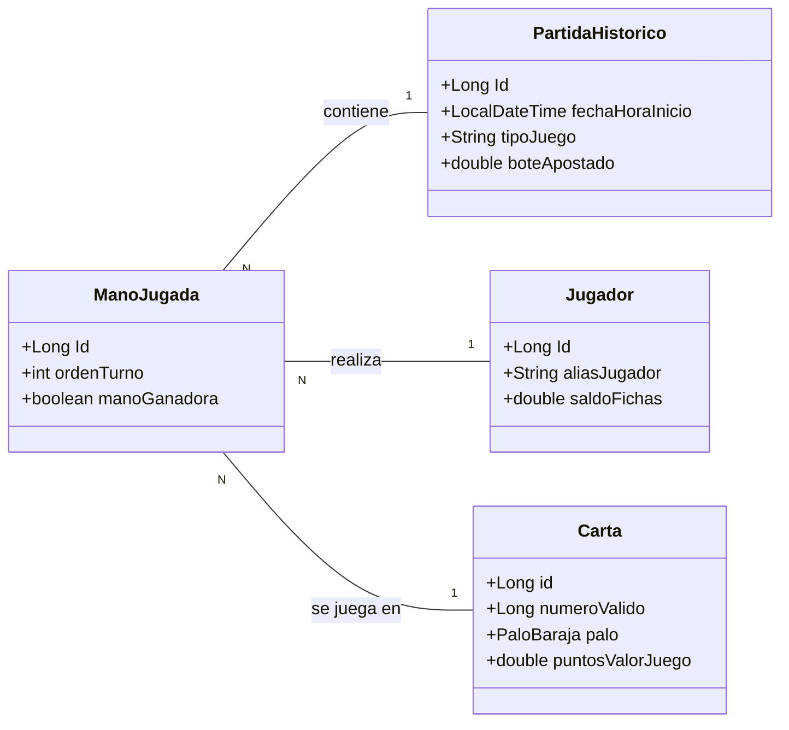

# Brisca


Aplicación API REST dockerizada de un juego de cartas llamado brisca hecha con Spring, Hibernate y MAVEN. 

## Tecnologias

| Tecnologia | Version | Uso |
|------------|---------|-----|
| Java | 21      | Lenguaje principal |
| Spring Boot | 4.0.3   | Framework backend |
| JPA/Hibernate | -       | Persistencia (ORM) |
| PostgreSQL | 42.7.10 | Base de datos (Docker) |
| H2 | -       | Base de datos (desarrollo) |
| Docker | 29.2.1  | Contenedorizacion |
| GitHub Actions | -       | CI/CD |
| Swagger/OpenAPI | 2.8.6   | Documentacion API |

## Arquitectura


## API Endpoints
### Jugadores
| Metodo | URL                   | Descripcion                |
|--------|-----------------------|----------------------------|
| GET | `/api/jugadores`      | Listar todos los jugadores |
| GET | `/api/jugadores/{id}` | Obtener jugadores por ID   |
| POST | `/api/jugadores`      | Crear nuevo jugador        |
| PUT | `/api/jugadores/{id}` | Actualizar jugadores       |
| DELETE | `/api/jugadores/{id}` | Eliminar jugadores         |
### Cartas
| Metodo | URL          | Descripcion            |
|--------|--------------|------------------------|
| GET | `/api/cartas` | Listar todos las cartas |
| GET | `/api/cartas/{id}` | Obtener cartas por ID  |
| POST | `/api/cartas` | Crear nueva carta      |
### PARTIDAS_HISTORICO
| Metodo | URL                 | Descripcion                          |
|--------|---------------------|--------------------------------------|
| GET | `/api/partidas_historico` | Listar el historico de partidas      |
| GET | `/api/partidas_historico/{id}`        | Obtener el historico partidas por ID |
| POST | `/api/partidas_historico`       | Crear un nuevo historico partidas    |

## Screenshot Swagger


## Como ejecutar
```powershell
docker-compose up -d --build
```
La url de la API es:
[http://localhost:8087/api/cartas](http://localhost:8087/api/cartas)
## Autor:
Alejandro Fraile del Olmo — Curso IFCD0014