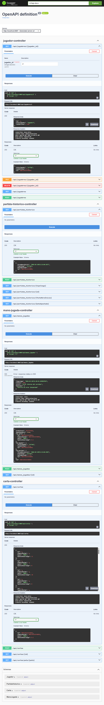

# Brisca


Descripcion breve de una linea: que hace la aplicacion y para quien.

## Tecnologias

| Tecnologia | Version | Uso |
|------------|---------|-----|
| Java | 17 | Lenguaje principal |
| Spring Boot | 4.0.x | Framework backend |
| JPA/Hibernate | 6.x | Persistencia (ORM) |
| PostgreSQL | 16 | Base de datos (Docker) |
| H2 | - | Base de datos (desarrollo) |
| Docker | - | Contenedorizacion |
| GitHub Actions | - | CI/CD |
| Swagger/OpenAPI | - | Documentacion API |

## Arquitectura

(Aqui va un diagrama Mermaid con las capas: Controller > Service > Repository > BD)

## API Endpoints

| Metodo | URL                   | Descripcion |
|--------|-----------------------|-------------|
| GET | `/api/jugadores`      | Listar todos |
| GET | `/api/jugadores/{id}` | Obtener por ID |
| POST | `/api/jugadores`      | Crear nuevo |
| PUT | `/api/jugadores/{id}` | Actualizar |
| DELETE | `/api/jugadores/{id}` | Eliminar |

## Screenshot Swagger



## Como ejecutar
```powershell
docker-compose up -d --build
```
## Autor

Alejandro Fraile del Olmo — Curso IFCD0014