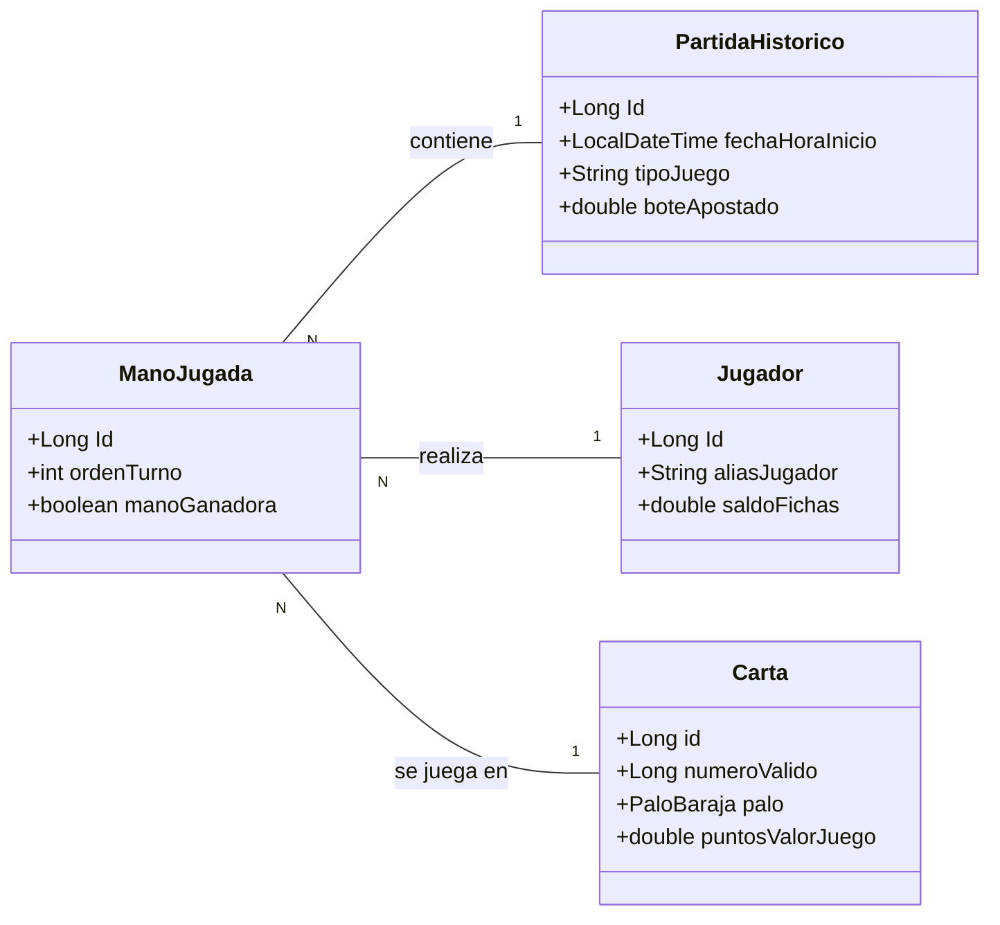

# Brisca


Aplicación dockerizada de un juego de cartas hecha con Spring, Hibernate y MAVEN. 

## Tecnologias

| Tecnologia | Version | Uso |
|------------|---------|-----|
| Java | 17 | Lenguaje principal |
| Spring Boot | 4.0.x | Framework backend |
| JPA/Hibernate | 6.x | Persistencia (ORM) |
| PostgreSQL | 42.7.10 | Base de datos (Docker) |
| H2 | - | Base de datos (desarrollo) |
| Docker | - | Contenedorizacion |
| GitHub Actions | - | CI/CD |
| Swagger/OpenAPI | - | Documentacion API |

## Arquitectura


## API Endpoints

| Metodo | URL                   | Descripcion |
|--------|-----------------------|-------------|
| GET | `/api/jugadores`      | Listar todos |
| GET | `/api/jugadores/{id}` | Obtener por ID |
| POST | `/api/jugadores`      | Crear nuevo |
| PUT | `/api/jugadores/{id}` | Actualizar |
| DELETE | `/api/jugadores/{id}` | Eliminar |

## Screenshot Swagger


## Como ejecutar
```powershell
docker-compose up -d --build
```
[localhost:8087/api/cartas](http://localhost:8087/api/cartas)
## Autor:
Alejandro Fraile del Olmo — Curso IFCD0014